# Threat Hunt Report - Just Another Day

**Case:** NH-INC-2026-0311 · Nimbus Health // Cyber Range SOC
**Platform:** Windows estate: billing, HR, IT, file server
**Window:** 8-18 March 2026 (activity window), 11 March 2026 (incident date)


---

## 1. Complete Scenario

### ☠️ Short Summary

Nimbus Health flagged a billing account for a routine "stale access" review. The telemetry showed otherwise: the account's sessions were remote-interactive logons from a public IP, not desk activity. The operator ran native recon (whoami, net view, nslookup), pivoted from the billing workstation to the file server and an IT box, reached beyond the billing role into the approval stage and audit trail, and staged HR payroll data inside the billing share under a disguised filename. A wider HR sweep showed the collection reached a second employee's payroll record and unrelated material. No malware or exploit was found anywhere. Overall, this was **valid-account compromise, discovery, lateral movement, and cross-department collection**, carried out entirely with living-off-the-land tooling.

---

**// REVIEW ASSIGNMENT // Nimbus Health**

> From: Hunt Lead // Cyber Range SOC
> To: Threat Hunt // On-Shift
> Re: Nimbus Health // billing account posture review
>
> Nimbus Health flagged a billing account for what the paperwork calls a stale-access housekeeping check. Treat it as an investigation and let the telemetry decide what it actually is.
>
> Work out: whether this is a curious employee or something else · what the account did outside its role · what sensitive material it reached and where it ended up · whether it stayed on one machine or moved · the honest root cause.
>
> Telemetry lives in the **law-cyber-range** Sentinel workspace, MDE tables: DeviceLogonEvents, DeviceProcessEvents, DeviceFileEvents, DeviceEvents. **Bound every query to 08-18 March 2026 and to nh-* hosts.** This is a shared workspace with a later, unrelated incident on the same estate.
>
> Don't accept the insider framing on trust. Follow the logs, not the paperwork.
>
> Section 00 is a gate: confirm workspace, window, and host filter, and acknowledge with **"Nimbus review ready"** before you begin.
>
> // Hunt Lead, Cyber Range SOC · Nimbus Health series, part one

---

### Live Announcement

> 🔵 **HUNT 11 // JUST ANOTHER DAY // LIVE**

> A routine posture review that turns out to be anything but. Nimbus Health flagged a billing account behaving oddly, the paperwork calls it stale access. It isn't.
>
> The account never left its desk on paper. In the logs, it's a different story entirely: a different kind of logon, a different source, a different set of hands on the keyboard.
>
> Filter first, every time. There's a later, separate incident on the same estate, and it's easy to lose the thread if you drift out of the March window.
>
> Difficulty: **Beginner**
>
> Flags: **20** // gate + 6 phases

---

### How To Hunt This [ method, not answers ]

A beginner hunt, but a real one: telling the intruder's hands-on activity apart from ordinary estate noise.

**01** Filter first. March window, nh-* hosts, every query.

**02** Question the framing. Read the source of the sessions before you accept the insider story.

**03** Cut the noise. A busy account's first hits are often an application maintaining itself.

**04** Pivot across tables. Logon, process, and file only tell the full story joined together.

**05** Follow the data. Watch where sensitive files end up, and under what name.

**06** A landing isn't activity. Prove what happened on each host reached, absence included.

**07** Reason from what's missing. No malware, no exploitation, valid credentials throughout.

**08** Then give the honest read, whatever the paperwork wanted it to be.

---

### Hunt Stages [ gate + 6 phases ]

| Phase | Focus |
|---|---|
| **00** | Setup gate: confirm the law-cyber-range workspace, the March window, and the nh-* filter |
| **01** | The billing account: the account under review, how it's being used, and the part that doesn't fit an insider |
| **02** | Hands on the keyboard: the noise to rule out, then the real recon and what it was aimed at |
| **03** | Past the role: reaching beyond the billing role, and the sensitive material moved under cover |
| **04** | Moving through the network: the onward hops, and the one that turns out to be a red herring |
| **05** | Collection: what the account did once it reached the file server, and whose data it took |
| **06** | Judgement: the scope of the theft, and the honest root cause the evidence supports |

> **Note on the absence.** Some of the strongest findings here are things that did not happen. No malware. No exploitation. A machine reached but never worked on. When a table you expect to be busy comes back quiet, that quiet is data. Reason from the gap, do not close on it.

---

## 2. Objective

Work Nimbus Health as a real posture-review-turned-investigation:

- Reconstruct what the billing account actually did across authentication, process, and file telemetry
- Question the insider framing rather than accepting it
- Separate genuine reconnaissance from application noise
- Follow the data rather than just the account
- Prove or rule out activity on every machine reached, including the ones that turn out to be dead ends
- Deliver the honest, evidence-supported root cause

---

## 3. Tools & Technologies

| Tool / Technology | Role in the Hunt |
|---|---|
| Microsoft Sentinel | Central query surface: `law-cyber-range` workspace |
| Microsoft Defender for Endpoint (MDE) | Source telemetry for logon, process, and file events |
| KQL | Query language used across all four MDE tables |
| DeviceLogonEvents | Authentication: logon type, source IP, remote sessions |
| DeviceProcessEvents | Process/command-line activity: recon, native tooling |
| DeviceFileEvents | File access, modification, and staging across shares |
| Windows estate | Billing, HR, IT, and file-server hosts (`nh-*`) |

---

## 4. Flags

### 🚩 Flag 1: The Account Under Review

**What to find:** The review flagged one billing account behaving oddly. Name it.

**Flag Data Block**

| Field | Value |
|---|---|
| **Answer** | j.morris |
| **Time (UTC)** | 2026-03-17T20:00:02.085Z |

**Details:** The billing account under review was identified as j.morris.

**Query:**
```kql
DeviceLogonEvents
| where TimeGenerated between (datetime(2026-03-08) .. datetime(2026-03-18))
| where DeviceName startswith "nh-"
| where RemoteIPType == "Public"
| summarize count() by AccountName
```

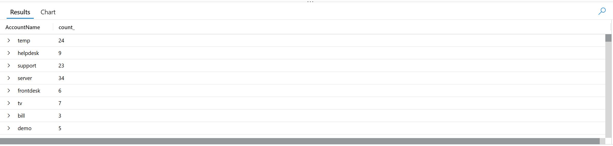

---

### 🚩 Flag 2: How the Account Is Being Used

**What to find:** This account isn't being used by someone sitting at the billing desk. Its successful sessions are a different kind of logon entirely. Give the logon type.

**Flag Data Block**

| Field | Value |
|---|---|
| **Answer** | RemoteInteractive |
| **Time (UTC)** | 2026-03-17T20:00:02.085Z |

**Details:** Successful sessions for j.morris were identified as RemoteInteractive logons, indicating the account was being used through remote interactive sessions rather than at the billing desk.

**Query:**
```kql
DeviceLogonEvents
| where TimeGenerated between (datetime(2026-03-08) .. datetime(2026-03-18))
| where AccountName == "j.morris"
| distinct LogonType
```

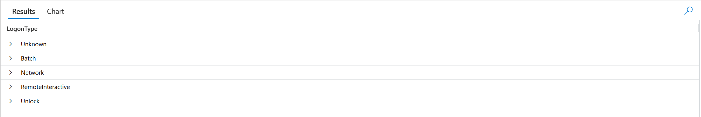

---

### 🚩 Flag 3: Where the Sessions Come From

**What to find:** Those remote sessions into the billing workstation are not coming from inside the clinic. Give one of the sources, and satisfy yourself it isn't an internal address.

**Flag Data Block**

| Field | Value |
|---|---|
| **Answer** | 136.144.33.18 |
| **Time (UTC)** | 2026-03-17T20:00:02.085Z |

**Details:** A successful RemoteInteractive session for j.morris originated from the public IP address 136.144.33.18, confirming the remote source was external to the clinic's internal network.

**Query:**
```kql
DeviceLogonEvents
| where TimeGenerated between (datetime(2026-03-08) .. datetime(2026-03-18))
| where AccountName == "j.morris"
| where LogonType == "RemoteInteractive"
| where RemoteIPType == "Public"
| project-reorder TimeGenerated, RemoteIP, *
```

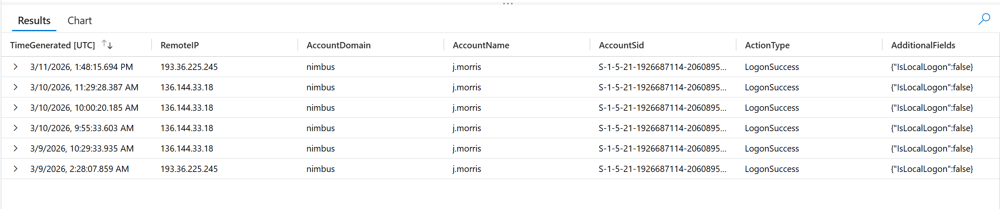

---

### 🚩 Flag 4: Signal or Noise

**What to find:** Sort the account's command-shell activity by time and the first thing you'll hit is a burst of deletions. Before building a theory on it, determine whether that's the intruder, or noise, and say how you know.

**Flag Data Block**

| Field | Value |
|---|---|
| **Answer** | It is noise because it's deleting files related to OneDrive |
| **Time (UTC)** | 2026-03-11T13:48:33.5988205Z |

**Details:** The early command-shell deletions are OneDrive-related file deletions and are therefore noise rather than intruder activity.

**Query:**
```kql
DeviceProcessEvents
| where TimeGenerated between (datetime(2026-03-08) .. datetime(2026-03-18))
| where AccountName == "j.morris"
| where InitiatingProcessCommandLine has "del"
| sort by TimeGenerated desc
| project TimeGenerated, InitiatingProcessCommandLine, InitiatingProcessFileName, FolderPath, FileName
```

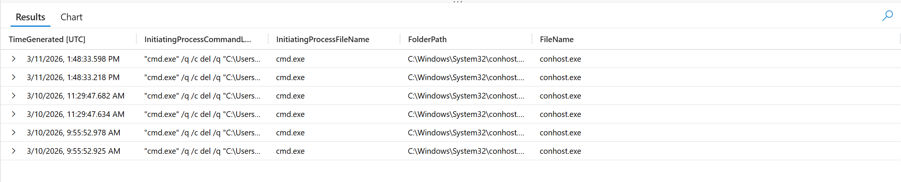

---

### 🚩 Flag 5: Getting Their Bearings

**What to find:** Past the noise, the account's operator runs a short, deliberate burst of native commands to get their bearings. Give that sequence, in order, including the server named on the final command.

**Flag Data Block**

| Field | Value |
|---|---|
| **Answer** | whoami, hostname, net use, net view, net view \\NH-FS-01 |
| **Time (UTC)** | 2026-03-11T13:37:23.542Z |

**Details:** The operator ran a short native reconnaissance sequence, whoami, hostname, net use, net view, and net view \\NH-FS-01, identifying the file server as the final target.

**Query:**
```kql
DeviceProcessEvents
| where TimeGenerated between (datetime(2026-03-08) .. datetime(2026-03-18))
| where DeviceName startswith "nh-"
| where AccountName == "j.morris"
| where InitiatingProcessFileName in~ ("cmd.exe", "powershell.exe")
| project TimeGenerated, DeviceName, AccountName, FileName, ProcessCommandLine, InitiatingProcessCommandLine, InitiatingProcessFileName
| order by TimeGenerated asc
```

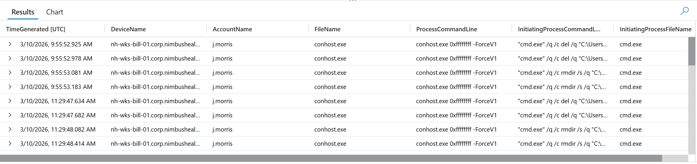

---

### 🚩 Flag 6: The Target of Recon

**What to find:** The recon wasn't aimless. The last discovery command names one system specifically. Which server were they lining up?

**Flag Data Block**

| Field | Value |
|---|---|
| **Answer** | NH-FS-01 |
| **Time (UTC)** | 2026-03-11T13:37:23.542Z |

**Details:** The final discovery command, net view \\NH-FS-01, specifically identified NH-FS-01 as the server the operator was lining up.

**Query:** Same as Flag 5

---

### 🚩 Flag 7: Widening the Net

**What to find:** The operator came back to the shell a second time, later, and widened the net beyond the single server. One command asks the domain itself what's out there. Give it.

**Flag Data Block**

| Field | Value |
|---|---|
| **Answer** | "net.exe" view /domain:nimbus |
| **Time (UTC)** | 2026-03-11T13:17:35.6183089Z |

**Details:** The operator widened reconnaissance beyond the single server by querying the Nimbus domain with "net.exe" view /domain:nimbus.

**Query:** Same as Flag 5

---

### 🚩 Flag 8: Mapping Before the Jump

**What to find:** Straight after the domain check, the operator spends two minutes building a picture of the local network, then immediately jumps to another host. Name what they did to map the local network, and the move it set up.

**Flag Data Block**

| Field | Value |
|---|---|
| **Answer** | nslookup, then RDP to 10.1.0.235 |
| **Time (UTC)** | 2026-03-11T13:18:51.6781043Z |

**Details:** The operator used nslookup to map the local network, then immediately used mstsc /v:10.1.0.235 to establish the next RDP hop.

**Query:** Same as Flag 5

---

### 🚩 Flag 9: Out of Role

**What to find:** A billing analyst on submissions has no business in the sign-off stage. But this account went there. Name the billing workflow folder it reached into that its role shouldn't touch.

**Flag Data Block**

| Field | Value |
|---|---|
| **Answer** | Approved |
| **Time (UTC)** | Not provided |

**Details:** The billing account reached the Approved billing workflow folder, which is downstream of the submission analyst's expected role.

**Query:**
```kql
DeviceFileEvents
| where DeviceName == "nh-wks-bill-01.corp.nimbushealth.com"
| where TimeGenerated between (datetime(2026-03-08) .. datetime(2026-03-18))
| where FolderPath has @"\\NH-FS-01\Billing"
| order by FolderPath asc
| project-reorder TimeGenerated, FolderPath, FileName, *
```

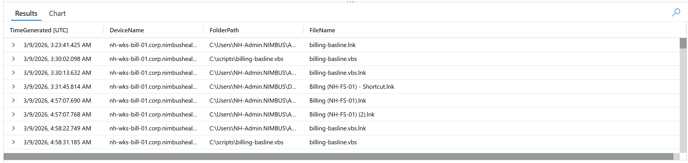

---

### 🚩 Flag 10: The Invoice

**What to find:** Inside that folder, name the invoice this account handled.

**Flag Data Block**

| Field | Value |
|---|---|
| **Answer** | approved_pending_invoice_INV-664215_20260310.txt |
| **Time (UTC)** | Not provided |

**Details:** The account handled the invoice file approved_pending_invoice_INV-664215_20260310.txt within the billing approval folder.

**Query:**
```kql
DeviceFileEvents
| where TimeGenerated between (datetime(2026-03-08) .. datetime(2026-03-18))
| where FolderPath has @"\Billing\2026-03\Approved"
| project TimeGenerated, DeviceName, FolderPath, FileName, ActionType
```

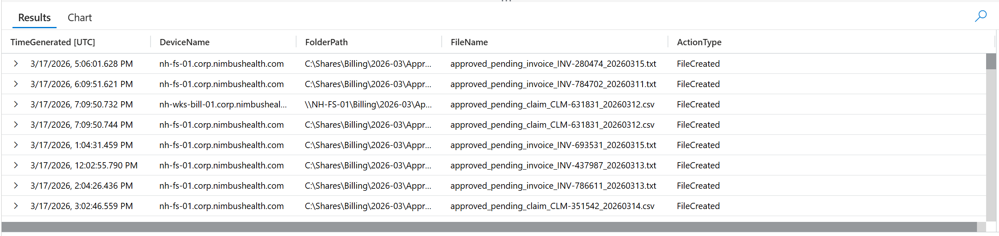

---

### 🚩 Flag 11: The Audit Trail

**What to find:** The account also touched the workflow's audit trail, the record that's supposed to reflect the reviewer's actions, not a submitter's. Name the audit file it modified.

**Flag Data Block**

| Field | Value |
|---|---|
| **Answer** | review_audit_20260311.txt |
| **Time (UTC)** | Not provided |

**Details:** The account j.morris modified the workflow audit file review_audit_20260311.txt.

**Query:**
```kql
DeviceFileEvents
| where TimeGenerated between (datetime(2026-03-08) .. datetime(2026-03-18))
| where FolderPath has "Audit"
| where RequestAccountName == "j.morris"
| project-reorder TimeGenerated, DeviceName, FolderPath, FileName, ActionType, *
| where ActionType == "FileModified"
```

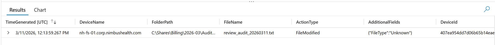

---

### 🚩 Flag 12: Staged Under Cover

**What to find:** The account pulled payroll material out of HR and dropped it into the billing share, renamed to look like a billing exception, so it would sit there without raising an eyebrow. Name the payroll file as it ended up in the billing folder.

**Flag Data Block**

| Field | Value |
|---|---|
| **Answer** | temp_payroll_review_jmorris_20260311.txt.txt |
| **Time (UTC)** | Not provided |

**Details:** The payroll material was staged into the billing share under the filename temp_payroll_review_jmorris_20260311.txt.txt, with the double .txt extension preserved in the file telemetry, a disguise intended to make the file look like a routine billing artifact rather than exfiltrated HR material.

**Query:**
```kql
DeviceFileEvents
| where TimeGenerated between (datetime(2026-03-08) .. datetime(2026-03-18))
| where FolderPath has "payroll"
| where FolderPath has "HR"
| where RequestAccountName == "j.morris"
| project-reorder TimeGenerated, DeviceName, FolderPath, FileName, ActionType, *
| where ActionType == "FileModified"
```

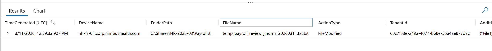

---

### 🚩 Flag 13: The Second Target

**What to find:** Payroll wasn't the only thing taken from HR. In the same burst, the account touched a second HR file that has nothing to do with payroll. Name it, and note what it tells you about the scope.

**Flag Data Block**

| Field | Value |
|---|---|
| **Answer** | quarterly_awards_shortlist_20260310.txt |
| **Time (UTC)** | 2026-03-11T12:54:33.907Z - 2026-03-11T13:04:33.907Z |

**Details:** During the same burst, j.morris modified quarterly_awards_shortlist_20260310.txt in the HR share. This shows the activity extended beyond payroll into unrelated HR material, indicating broader cross-department collection rather than a narrowly targeted payroll grab.

**Query:**
```kql
DeviceFileEvents
| where TimeGenerated between (datetime(2026-03-11T12:54:33.907Z) .. datetime(2026-03-11T13:04:33.907Z))
| where FolderPath has "C:\\Shares\\HR\\2026-03"
| where RequestAccountName == "j.morris"
| project-reorder TimeGenerated, DeviceName, FolderPath, FileName, ActionType, *
| where ActionType == "FileModified"
```

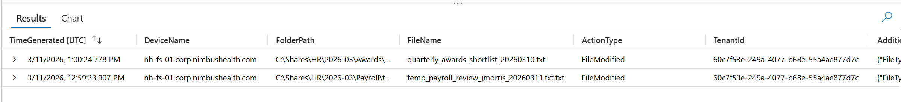

---

### 🚩 Flag 14: The Onward Hops

**What to find:** The account didn't stop at the billing box. From there it opened remote sessions onto two more machines. Name both.

**Flag Data Block**

| Field | Value |
|---|---|
| **Answer** | nh-fs-01.corp.nimbushealth.com, nh-wks-it-01.corp.nimbushealth.com |
| **Time (UTC)** | Not provided |

**Details:** j.morris opened successful remote interactive sessions from the billing workstation's own internal address, 10.1.0.207, onto nh-fs-01.corp.nimbushealth.com and nh-wks-it-01.corp.nimbushealth.com, confirming the account pivoted inward from the billing workstation to two further hosts.

**Query:**
```kql
DeviceLogonEvents
| where TimeGenerated between (datetime(2026-03-08) .. datetime(2026-03-18))
| where AccountName == "j.morris"
| where ActionType == "LogonSuccess"
| where RemoteIP == "10.1.0.207"
| distinct DeviceName
```

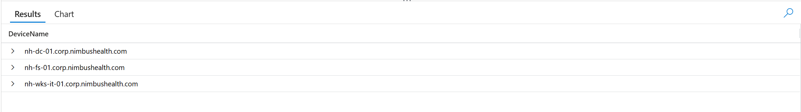

---

### 🚩 Flag 15: The Red Herring

**What to find:** One of the two hops is a red herring, prove it rather than assume it. The account landed on the IT workstation. Did it actually do anything there?

**Flag Data Block**

| Field | Value |
|---|---|
| **Answer** | No malicious activity occurred on the IT workstation |
| **Time (UTC)** | Not provided |

**Details:** j.morris successfully reached nh-wks-it-01.corp.nimbushealth.com from 10.1.0.207, but the process telemetry, filtered clear of routine background/update noise, shows no malicious activity on the IT workstation. The landing is real; the activity on it is not.

**Query:**
```kql
DeviceProcessEvents
| where TimeGenerated between (datetime(2026-03-08) .. datetime(2026-03-18))
| where AccountName == "j.morris"
| where DeviceName == "nh-wks-it-01.corp.nimbushealth.com"
| where ProcessRemoteSessionIP == "10.1.0.207"
| where ProcessCommandLine !contains "setup.exe"
and ProcessCommandLine !contains "msedge"
and ProcessCommandLine !contains "dll"
and ProcessCommandLine !contains "menu"
and ProcessCommandLine !contains "background"
| distinct ProcessCommandLine
```

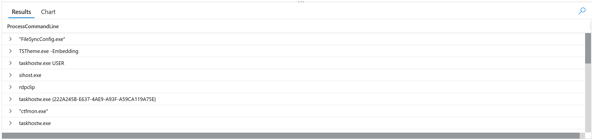

---

### 🚩 Flag 16: Checking Their Rights

**What to find:** On the file server, the account's operator ran a command to check what privileges and groups they had. Give it.

**Flag Data Block**

| Field | Value |
|---|---|
| **Answer** | "whoami.exe" /groups |
| **Time (UTC)** | 2026-03-11T13:37:23.5424345Z |

**Details:** On the file server, j.morris ran the exact command "whoami.exe" /groups to check the account's privileges and group memberships.

**Query:**
```kql
DeviceProcessEvents
| where TimeGenerated between (datetime(2026-03-08) .. datetime(2026-03-18))
| where AccountName == "j.morris"
| where DeviceName == "nh-fs-01.corp.nimbushealth.com"
| where InitiatingProcessCommandLine contains "cmd.exe"
or InitiatingProcessCommandLine contains "powershell.exe"
```

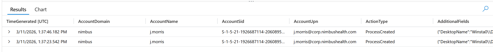

---

### 🚩 Flag 17: What the Server Offered

**What to find:** Right after the privilege check, the account enumerated what the file server was offering. Give that command.

**Flag Data Block**

| Field | Value |
|---|---|
| **Answer** | "net.exe" share |
| **Time (UTC)** | 2026-03-11T13:37:46.1954869Z |

**Details:** Immediately after checking the account's privileges and group memberships, j.morris ran "net.exe" share on nh-fs-01.corp.nimbushealth.com to enumerate the shares offered by the file server.

**Query:**
```kql
DeviceProcessEvents
| where TimeGenerated between (datetime(2026-03-11T13:37:23.5424345Z) .. datetime(2026-03-18))
| where AccountName == "j.morris"
| where DeviceName == "nh-fs-01.corp.nimbushealth.com"
```

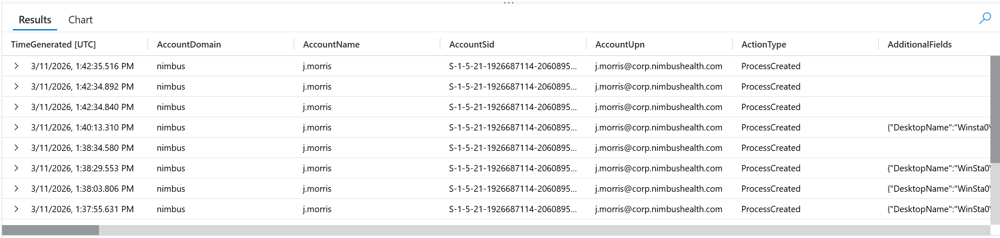

---

### 🚩 Flag 18: Someone Else's Payroll

**What to find:** The last thing the account did on the file server was open a payroll review belonging to a different employee entirely. Name the file, and note whose it is.

**Flag Data Block**

| Field | Value |
|---|---|
| **Answer** | payroll_review_dpatel_20260311.txt |
| **Time (UTC)** | 2026-03-11T13:40:08.8576227Z |

**Details:** The account j.morris opened payroll_review_dpatel_20260311.txt on the file server, a payroll review belonging to employee dpatel, an individual with no other connection to the billing role or the incident.

**Query:**
```kql
DeviceFileEvents
| where TimeGenerated between (datetime(2026-03-11T13:37:23.5424345Z) .. datetime(2026-03-18))
| where InitiatingProcessAccountName == "j.morris"
| where DeviceName == "nh-fs-01.corp.nimbushealth.com"
```

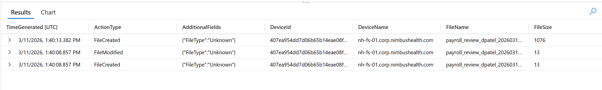

---

### 🚩 Flag 19: What Else Left HR

**What to find:** Step back over the HR collection. Beyond the one payroll file everyone notices, characterise what this account took out of HR. Give the scope in a sentence.

**Flag Data Block**

| Field | Value |
|---|---|
| **Answer** | Payroll material, a quarterly awards shortlist, and a newly created text document |
| **Time (UTC)** | 2026-03-11T13:00:24.7781342Z |

**Details:** Beyond the payroll material, the account also took the quarterly_awards_shortlist document from HR and created a new text document within the same folder, showing the collection extended past a single targeted file into broader, unrelated HR material.

**Query:**
```kql
DeviceFileEvents
| where TimeGenerated between (datetime(2026-03-08) .. datetime(2026-03-18))
| where FolderPath has "C:\\Shares\\HR\\2026-03\\"
| where RequestAccountName == "j.morris"
| project-reorder TimeGenerated, DeviceName, FolderPath, FileName, ActionType, *
```

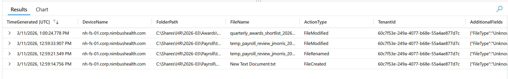

---

### 🚩 Flag 20: The Honest Read

**What to find:** The clinic will want to write this up as a curious employee with leftover access. Give the honest read: what actually happened, and what's missing that rules out malware and a routine insider mistake.

**Flag Data Block**

| Field | Value |
|---|---|
| **Answer** | Account compromise using valid credentials from an external source; no malware or exploitation was present |
| **Time (UTC)** | N/A |

**Details:** The j.morris account was compromised and driven by an intruder using valid credentials from a remote public IP address, not by the billing analyst themselves. The activity used exclusively native Windows tools (mstsc, whoami, net, nslookup) for reconnaissance, lateral movement, and collection. No malware, no dropped binaries, and no exploitation were found anywhere in the chain. That absence, combined with the external RemoteInteractive source and the deliberate, out-of-role reconnaissance-to-collection sequence, rules out both a "curious employee" explanation and a routine insider mistake, and instead points to a valid-account (T1078) compromise driven entirely from outside the network.

**Query:** N/A, synthesis across DeviceLogonEvents, DeviceProcessEvents, and DeviceFileEvents

---

## 🛡️ Security Recommendations

1. **Verify session origin, not just credentials:** Alert on RemoteInteractive logons to workstation-tier accounts (e.g. billing analysts) that originate from public/external IP space. Valid credentials alone should not be treated as proof of legitimate use.

2. **Baseline role-appropriate access:** Flag file access that falls outside an account's normal workflow stage. A submissions-only billing account reaching into the Approved folder, or an audit-trail file being modified by a non-reviewer, should generate a detection rather than sit unnoticed.

3. **Detect cross-share staging and renaming:** Watch for files moved between shares (HR to Billing) and saved under names or double extensions designed to blend into the destination folder. This kind of disguised staging is a strong signal of deliberate exfiltration prep, not routine file handling.

4. **Monitor native reconnaissance tooling:** whoami, hostname, net view, net use, and nslookup run in short, deliberate bursts by non-IT accounts are a reliable discovery signature even when no malware is present. Correlate these with the account's normal job function.

5. **Confirm, don't assume, lateral activity:** When an account reaches a second or third host, prove what happened there rather than treating the landing itself as the finding. An empty result on one hop (as with the IT workstation here) is still evidence and should be documented, not skipped.

6. **Reason from absence:** No malware and no exploitation, paired with valid credentials and an external source, is itself a diagnostic pattern (T1078, Valid Accounts). Build detection logic and analyst guidance around this combination rather than requiring a malicious binary to trigger a response.
